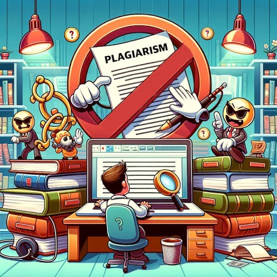

<html lang="en">
<head>
    <meta charset="UTF-8">
    <meta name="viewport" content="width=device-width, initial-scale=1.0">
    <title>Journey and Insights</title>
    
</head>
<body>
    <header>
        <h1>My Lab Exercises</h1>
        <nav>
            <a href="#">Home</a>
            <a href="#">Stories</a>
            <a href="#">Tech Blog</a>
            <a href="#">Contact Us</a>
        </nav>
    </header>
    <!-- Introduction -->
    

        <h2> JOEY FULLEROS</h2>
        <h3> 2-India </h3>
        
        
Guess what ? Today you will be going to recognize the one and only Joey L. Fulleros. Joey was born on a warm, sunny day in January 5 2005 in Bulusan Sorsogon, place of people who always being great in their life. He is the youngest child of Mrs. Remy Fulleros and Mr. Miguel Fulleros. He's parents didn't failed to raise him in a good way even though his father died too soon because of illnesses. When his father died, Joey became more stronger and independent like what his father taught him when he was alive. At a very young age Joey learned every possible thing that could make them alive or every possible thing for them have everyday needs. He worked pretty in every single day, he put aside being a child , he suffer a lot of difficulties in life. All of that truly change him, his character, and personalities, he became more matured not because of his age but because of his situation. Joey focused on his study and at the same time on his side hustled. Because of being great, Joey achieves a lot of achievements, he became an honor student consecutively in high school. He also had things he likes because of the best of his ability that does not depend on his parents. That makes him more persistent and consistent with his dreams because he is always thirsty for success. When Joey finished studying in high school he decided not to pursue college, for the reason that he always thinks about their financial situation. But his mother  and his siblings never failed to support and encourage him to continue studying and pursue college and achieve the career he wants. At first,Joey suffers difficulty choosing a career, as time goes by Joey decided to take Criminology Entrance Examination in Sorsogon College of Criminology Inc. and finally wants to pursue the path of becoming a future Law Enforcer. On his first entrance exam he never failed that's why he truly understood that he was going to fit on the path that he took. Oh! by the way,let me tell you something about Joey. He's a man who always wants new things every  single day of his life. He wants new sufferings, memories, achievements even small things that could make him feel alive. There's a lot of things he likes and he doesn't like. He likes to have fun with friends like adventures ,sports, and other recreational activities that could make him move,especially fishing at Bulusan Lake ,one of the best bonds they'd do with his father before. He also loves to cook which his mother taught him anything he wants to eat, he cooks it because for him any food that is hard and takes a long time to cook is delicious. His specialty recipes are Laing Adobo sa Gatang Native chicken,especially when it is (tinutungan) which could be done by burning the grated coconut to make the milk more flavorful. Also he loves engaging in Physical Activities, he loves getting into fit, getting sweat and making himself active. He is really great, huh? Doesn't he? So far I have told you those things about Joey. Now, I am going to tell you one of the biggest things he hates in this world is to be" BORED". Just saying this world makes him really sick like I told you before, there are a lot of things he likes and some things he doesn't like. Looks like I already told you everything about Joey huh, but let's end this here because I dont want to expose him very well. Lastly, for now he is truly focusing on his study and I promise he is always doing his best to be  great and achieve his dream for his family.

    

    <!-- Blog Section -->
    

        <h2>Staying Safe in the Digital Era</h2>
        <iframe width="100%" height="315" src="https://www.youtube.com/embed/PM9O7rk69Cw" 
                title="YouTube Video" frameborder="0" allowfullscreen></iframe>
        

1. Viruses
- Imagine a tiny bug that can copy itself and spread to other computers. That's what a virus is like! It can mess up your files, steal your information, or even take control of your computer.
2. Malware
- Malware is a big group of bad guys, including viruses, worms, and Trojans. They can do all sorts of nasty things, like steal your passwords, track what you do online, or even shut down your computer.
3. Spam
- Spam is like unwanted junk mail, but for your email inbox. It's usually annoying ads or scams trying to trick you into clicking on dangerous links.
4. Antiviruses
- Antiviruses are like superheroes for your computer! They are special programs that hunt down and destroy viruses and malware. They act like a shield, protecting your computer from these bad guys.

        <ul>
            <li><strong>Think Before You Click:</strong> Avoid suspicious links and unknown sources.</li>
            <li><strong>Update Regularly:</strong> Keep your software and antivirus up-to-date.</li>
            <li><strong>Secure Passwords:</strong> Use unique, complex passwords for all accounts.</li>
        </ul>
        

    

    <!-- Article Section -->
    

        <h2>Integrity Matters: A Look at Plagiarism</h2>
        
        
Plagiarism is like stealing someone's idea or words and pretending it's your own. It's like taking a friend's toy and saying you made it yourself. It's not fair, and it can get you into big trouble.

        <table>
            <thead>
                <tr>
                    <th>Scenario</th>
                    <th>Region</th>
                    <th>Impact</th>
                </tr>
            </thead>
            <tbody>
                <tr>
                    <td>Academic Misconduct</td>
                    <td>USA</td>
                    <td>Expulsion from University</td>
                </tr>
                <tr>
                    <td>Copycat Product Design</td>
                    <td>Europe</td>
                    <td>Massive Fines</td>
                </tr>
                <tr>
                    <td>Copied Content</td>
                    <td>Asia</td>
                    <td>Public Scandal</td>
                </tr>
            </tbody>
        </table>
        <audio controls>
            <source src="videoplayback (5).webm" type="audio/webm">
            Your browser does not support the audio tag.
        </audio>
    

    <!-- Contact Section -->
    

        <h2>We'd Love to Hear From You</h2>
        <form action="submit-contact.php" method="post">
            <label for="name">Your Name:</label>
            <input type="text" id="name" name="name" required>
            <label for="email">Email Address:</label>
            <input type="email" id="email" name="email" required>
            <label for="message">Message:</label>
            <textarea id="message" name="message" rows="4" required></textarea>
            <button type="submit">Send Message</button>
        <label for="gender">Does it helpful?</label>
        <input type="radio" id="male" name="gender" value="male">
        <label for="male">Yes</label>
        <input type="radio" id="No" name="gender" value="female">
        <label for="female">No</label>
        <label for="hobbies">Talent:</label>
        <input type="checkbox" id="reading" name="hobbies" value="reading">
        <label for="reading">Sing</label>
        <input type="checkbox" id="traveling" name="hobbies" value="traveling">
        <label for="traveling">Dance</label>
        <input type="checkbox" id="sports" name="hobbies" value="sports">
        <label for="sports">Act</label>
        </form>

